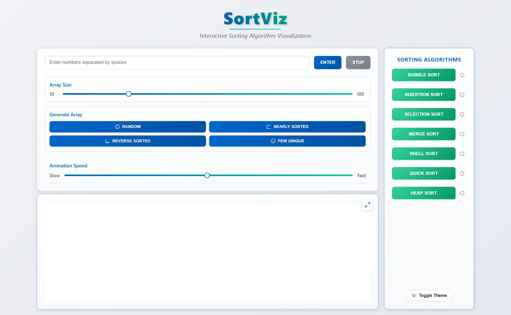

# SortViz - Interactive Sorting Algorithm Visualizer

SortViz is a modern, interactive web application that visualizes various sorting algorithms in real-time. It helps users understand how different sorting algorithms work through dynamic visualization and educational information.

## Features

- **Interactive Visualization**: Watch sorting algorithms in action with a dynamic, canvas-based visualization
- **Multiple Sorting Algorithms**:
  - Bubble Sort
  - Insertion Sort
  - Selection Sort
  - Merge Sort
  - Shell Sort
  - Quick Sort
  - Heap Sort

- **Array Generation Options**:
  - Random arrays
  - Nearly sorted arrays
  - Reverse sorted arrays
  - Arrays with few unique values
  - Custom input arrays

- **Customization**:
  - Adjustable array size (10-100 elements)
  - Controllable animation speed
  - Dark/Light theme toggle
  - Fullscreen visualization mode

- **Educational Content**:
  - Detailed information about each algorithm
  - Time complexity analysis
  - Space complexity details
  - Real-world use cases
  - Step-by-step explanation of how each algorithm works

## Getting Started

1. Clone this repository
2. Open `index.html` in your web browser
3. Start experimenting with different sorting algorithms!

## Usage

1. **Generate Data**:
   - Use the array generation buttons to create different types of arrays
   - Or enter your own numbers in the input field

2. **Customize Visualization**:
   - Adjust the array size using the slider
   - Control the animation speed
   - Toggle between light and dark themes

3. **Run Algorithms**:
   - Select any sorting algorithm to start the visualization
   - Use the stop button to halt the current sorting process
   - Click the expand button for fullscreen view

4. **Learn More**:
   - Click the information icon next to each algorithm to learn about its:
     - Time complexity
     - Space complexity
     - Working mechanism
     - Practical applications

## Technologies Used

- HTML5 Canvas for visualization
- CSS3 for styling
- Vanilla JavaScript for functionality
- SVG icons for UI elements

## Browser Support

- Chrome (recommended)
- Firefox
- Safari
- Edge

## Contributing

Feel free to submit issues and enhancement requests!

## License

This project is licensed under the MIT License - see the LICENSE file for details. 